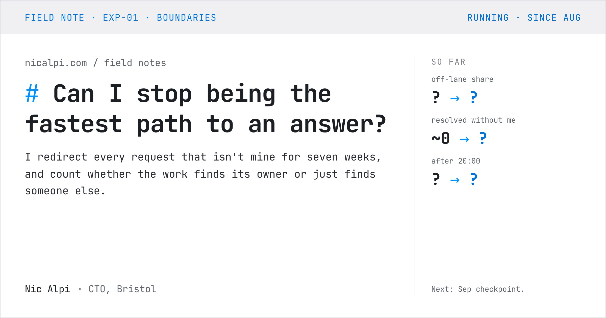
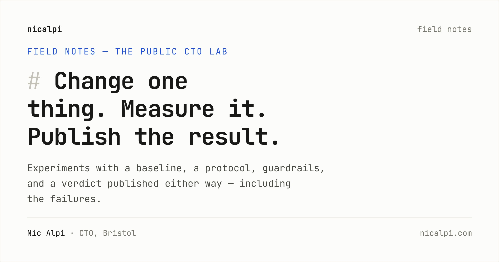
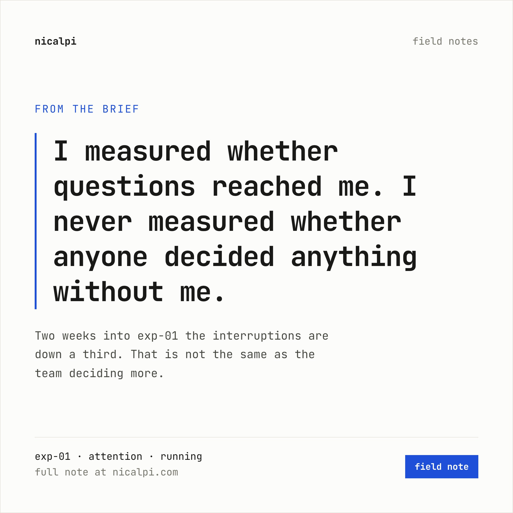
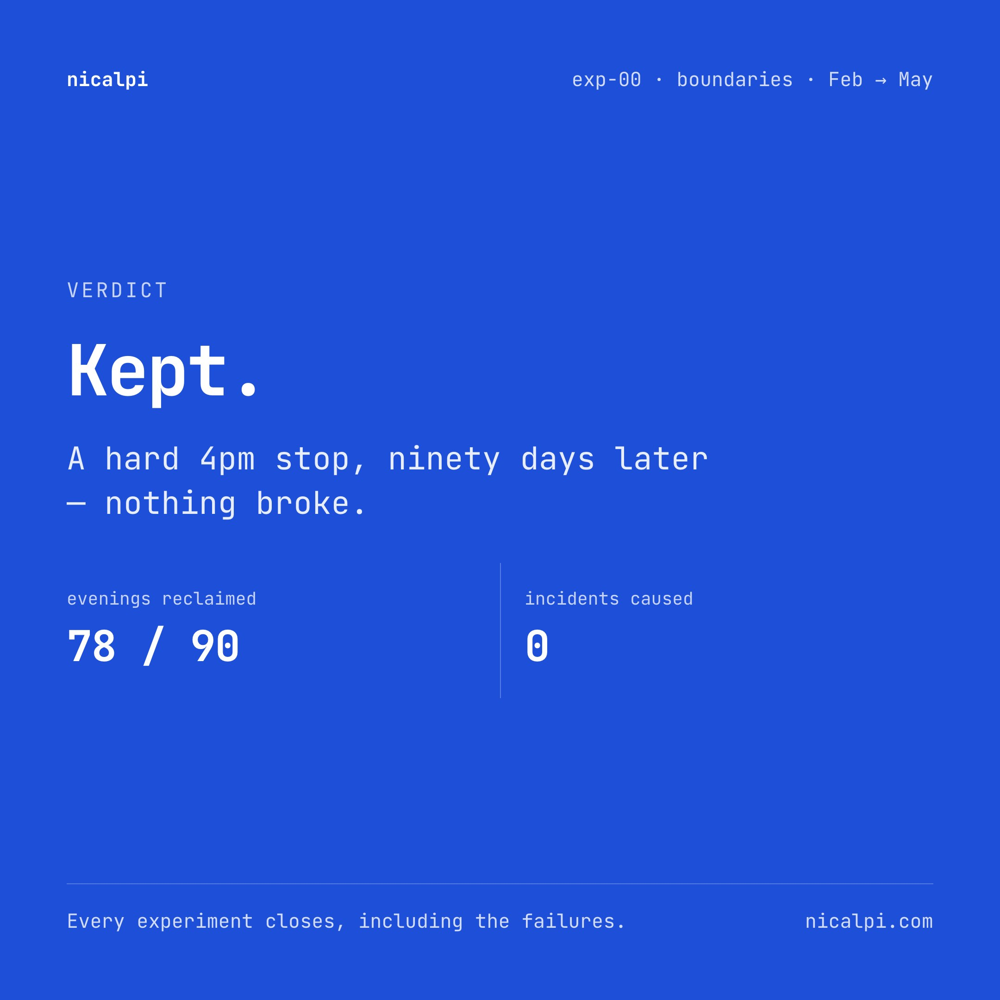
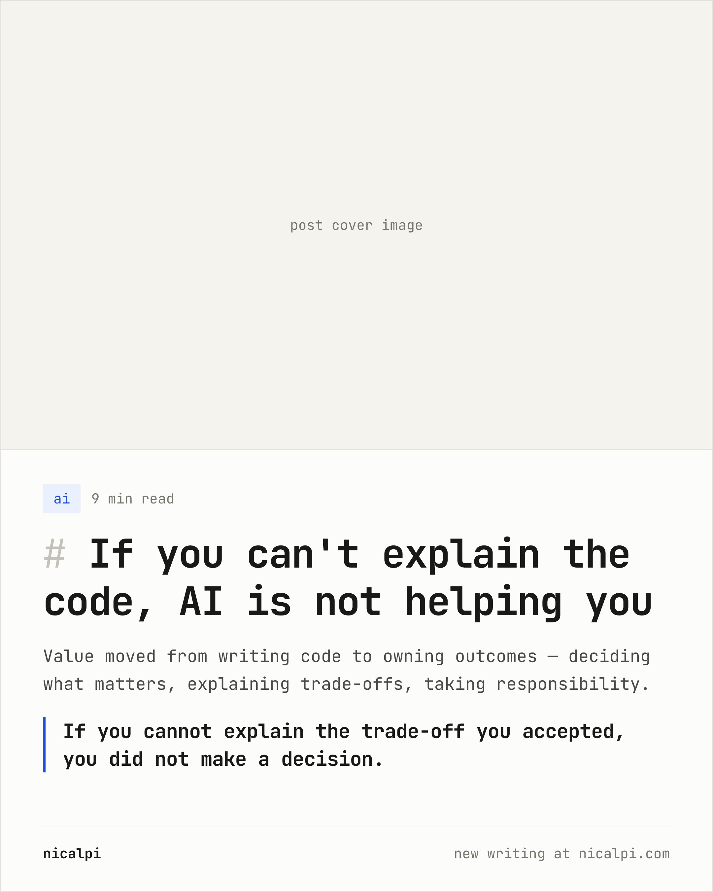
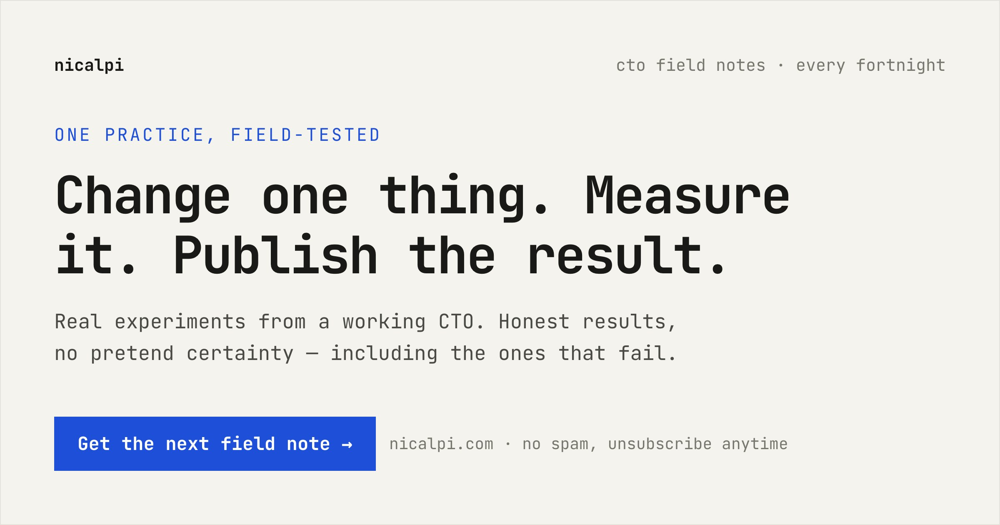

# nicalpi.com — site guide

Everything you need to publish: social images, the component library, and
the field-notes workflow. (Maintainer docs — not published on the site.)

- Brand system: `.claude/skills/nicalpi-brand/SKILL.md`
- Live components: [`/styleguide/`](https://www.nicalpi.com/styleguide/)
- This guide covers the *how-to*; the skill files cover the *rules*.

---

## 1. Social media images

Every page ships a 1200×630 social card (rendered at 2× → 2400×1260 JPEG).

**How it works**

1. A page declares its card in front matter:
   ```yaml
   og_image: /assets/images/og/<slug>.jpg
   ```
2. `_includes/head.html` emits `og:image` **and** `twitter:image` from that
   one value (no `-twitter` variants — Twitter reuses the OG image).
3. The jpg lives in `assets/images/og/` and is **generated, committed, and
   never hand-edited**.

**Generating**

```bash
pip3 install playwright              # once — drives your installed Chrome

python3 scripts/generate-og.py               # regenerate every card
python3 scripts/generate-og.py <slug> …      # only these slugs
python3 scripts/generate-og.py --examples    # also render the promo-template gallery
python3 scripts/generate-og.py --check       # CI-able: every page has og_image + file exists
```

The script reads front matter from `_posts/` and `_field_notes/`, picks the
right template, and fills it:

| Page kind | Template | Data used |
|---|---|---|
| Homepage | `og-home.html` (bespoke, static) | the template *is* the content |
| Blog post | `og-post.html` | `title`, `subtitle`/`description`, `category`, `reading_time`; slug from `og_image` |
| Experiment brief | `og-field-note.html` | `title`, `summary`/`lead`, `status_label`, `home:`-flagged `metrics` (or `facts`), `verdict` |
| Progress note | `og-field-note.html` | `title`, `lead`, `status_label`, first 3 `metrics`, `next_label` |
| Site pages (writing, about, contact, field-notes index, styleguide, 404) | `og-page.html` | the `PAGES` list inside the script |

Run `--check` before shipping new content; it fails if any published page is
missing its card.

## 2. The templates

All templates live in `assets/social-templates/`, share the site tokens via
`social.css`, and support a dark variant with `?theme=dark` in the URL.

### Generator-driven (have `{{…}}` slots — don't fill by hand)

| | |
|---|---|
| `og-home.html` — bespoke homepage brand card |  |
| `og-post.html` — blog post link card |  |
| `og-field-note.html` — field note / progress note, with the before → now stats column |  |
| `og-page.html` — generic site page |  |

Manual one-off from a generator template: run the script with just that slug,
e.g. `python3 scripts/generate-og.py exp-01`.

### Hand-edited promo cards (open, edit text in place, export)

Rendered examples live in `assets/images/social/examples/` (regenerate with
`--examples`).

| | |
|---|---|
| `quote-square.html` — 1080×1080 quote card (Instagram, LinkedIn) |  |
| `verdict-square.html` — 1080×1080 experiment-close card; the only solid-accent surface |  |
| `post-promo-portrait.html` — 1080×1350 portrait-feed post promo |  |
| `newsletter-og.html` — 1200×630 subscribe card |  |

Manual export of a promo card after editing it:

```bash
# Node route (downloads chromium once):
npm i -D playwright && npx playwright install chromium
node scripts/export-social.mjs quote-square        # → assets/images/social/, light + dark, 2×

# or quick-and-dirty at 1×:
npx -y playwright screenshot --viewport-size="1080,1080" \
  "assets/social-templates/quote-square.html?theme=dark" quote-dark.png
```

## 3. Using the components

CSS source is `_assets/main.css` — after any change run `yarn css` (the
compiled `assets/main.css` is committed). Everything renders live at
[`/styleguide/`](https://www.nicalpi.com/styleguide/); the full reference with
every class is `.claude/skills/nicalpi-brand/components.md`.

The ones you'll reach for most, usable **inside markdown bodies** (Jekyll
runs Liquid before markdown):

```liquid
## Measures


## Guardrails


## Field log




```

The data (`page.metrics`, `page.guardrails`, …) lives in front matter — see
the schemas in `_field_notes/README.md`. Page-shell pieces (`sidebar.html`
with its `context` parameter, `nav-top.html`, `mobile-bar.html`,
`newsletter.html`) are documented in the components reference.

Primitives, anywhere in HTML: `.btn` / `.btn-ghost` / `.btn-sm`, `.chip` /
`.chip-solid`, `.kicker`, `.meta-block`, `.xcard`, `.queued-box`,
`.progress-track`, and the `md-mark` heading marks
(`<h1><span class="md-mark"># </span>Title</h1>`).

## 4. Creating a field note

An experiment goes: **queued → brief (running) → progress notes → verdict**.

**a. Queue it** (optional) — add to `_data/field_notes.yml`; it appears in
the "queued" boxes on `/field-notes/` and the homepage.

**b. Write the brief** — `_field_notes/exp-NN.md`. Copy `exp-01.md` as the
running-experiment starting point (`exp-00.md` for the closed shape). The
front-matter contract (full schema in `_field_notes/README.md`):

```yaml
kind: experiment
exp: 2                    # number, drives ordering
exp_id: exp-02            # stable id progress notes point at
title: / lead: / summary:  # page h1 · dek · index-card one-liner
theme_tag: ai             # attention | boundaries | delivery | ai …
status: running           # running | closed (+ verdict: kept|dropped|inconclusive)
status_label: "running · since Oct"
started: / window: / measure: / next_label:   # the meta block
progress_pct: 10
permalink: /field-notes/exp-02/
og_image: /assets/images/og/exp-02.jpg
roadmap: ["Nov — checkpoint", "Dec — verdict"]
facts: [...]              # index-card right column
metrics: [...]            # before/now/target; flag up to 3 with home: true
guardrails: [...]
field_log: [...]
```

Body = markdown sections (`## The question`, `## Hypothesis`, `## The
protocol`) with the includes from §3 wherever they fit. Every `##` lands in
the sidebar "on this page" list automatically.

**c. Generate its card** — `python3 scripts/generate-og.py exp-02`

**d. Remove it from the queue** in `_data/field_notes.yml`.

### Adding a progress note

**a.** `_field_notes/exp-NN/<slug>.md`, copy `exp-01/the-questions-moved.md`:

```yaml
layout: progress_note     # explicit — briefs get their layout by default
kind: progress
experiment: exp-02        # parent exp_id — wires up sidebar, crumbs, cards
note_id: fn-02.1
nav_label: "Nov — progress"   # sidebar tree label
title: / lead: / date: / published_label: / status_label:
reading_time: 4
next_label: "Dec verdict"
permalink: /field-notes/exp-02/<slug>/
og_image: /assets/images/og/<slug>.jpg
metrics: / adjustments: / guardrail_check:   # same shapes as the brief
```

Body order that works well: `## What changed` → `## The numbers so far`
(metrics + honest-caveat caption) → `## What I got wrong` → `## What I'm
adjusting` → `## Guardrail check`.

**b.** Update the brief: bump `progress_pct`, tick `field_log` entries,
adjust `roadmap`.

**c.** `python3 scripts/generate-og.py <slug>` then `--check`.

### Closing an experiment

Set `status: closed`, `verdict: kept|dropped|inconclusive`,
`status_label: "closed · kept"`, `progress_pct: 100`, add a `## Verdict — …`
section to the body, regenerate its card (the stats column flips to "the
verdict"), and celebrate publishing a failure if it is one.

## 5. The authoring skills

Nine skills automate the workflows above — in Claude Code here, and in
your personal Claude Web account. The pattern is always **think → write**:
a THINK skill interviews you and applies judgment until the idea is framed;
a WRITE skill turns the frame into on-brand files.

| Skill | What it does |
|---|---|
| `field-note-think` | Braindump → experiment frame (question, baseline, hypothesis, protocol, metrics, guardrails, window) |
| `field-note-write` | Frame → `_field_notes/exp-NN.md` + queue update + OG image |
| `progress-think` | Checkpoint debrief → progress frame (numbers vs baseline, what went wrong, guardrail check, adjustments) |
| `progress-write` | Frame → `_field_notes/exp-NN/<slug>.md` + brief updates (field log, progress %, roadmap) + OG image |
| `quick-log` | One-line idea → `.writings-memory/ideas.md`. No questions. |
| `writing-outline` | Idea → approved `.writings-memory/<slug>/outline.md` (claim, reader, receipts, counterargument, structure) with a cold read |
| `writing-plan` | Outline → `.writings-memory/<slug>/plan.md`, your words and numbers captured verbatim per section |
| `writing-post` | Plan → drafts → approval → `_posts/…` + OG image, ticks the idea, updates `memory.md`, cleans up |
| `social-image` | Any card, from the right template — generated OG or hand-edited promo |

**Typical flows**

- New experiment: `field-note-think` → `field-note-write` → (fortnight of
  baseline) → live.
- Checkpoint: `progress-think` → `progress-write` → share with
  `social-image` (quote card from the note's blockquote).
- Essay: `/quick-log` → `/writing-outline` → `/writing-plan` → `/writing-post` (humanizer and cold read run inside) → `social-image`. State lives in `.writings-memory/` (see its README); three agents back it: `writing-researcher`, `writing-reader`, `writing-drafter` in `.claude/agents/`.

**Using them on Claude Web (personal, not org-shared)**

1. `./scripts/package-skills.sh` → zips in `dist/claude-web-skills/`.
2. claude.ai → **Settings → Capabilities → Skills → Upload skill**, upload
   each zip. They stay private to your account.
3. On the web the write skills can't touch the repo — they output complete
   file contents to paste, plus the generator commands to run locally.
